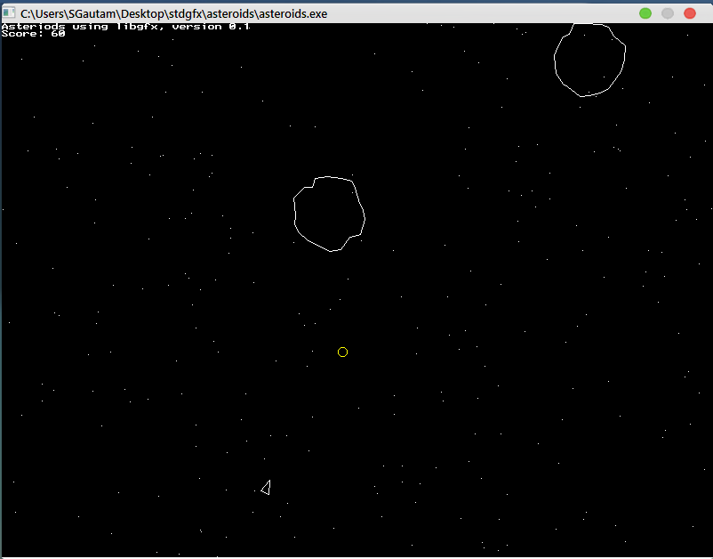
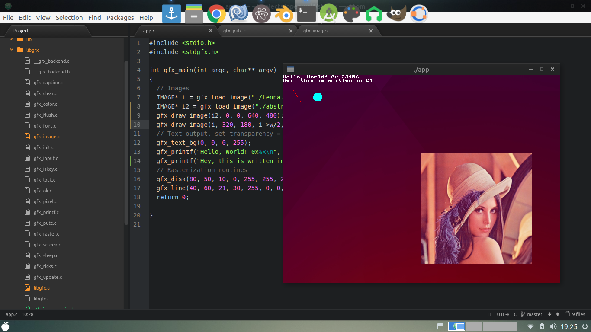

# stdgfx
The Standard C Graphics Library (in an alternate universe!)

This is an under-development graphics library for the C programming language
that aims to make development and prototyping on C/C++ easy as pie! C has always
lacked a proper graphics interface, and although things like SDL, and OpenGL exist
they always have a large learning curve attached to them which makes beginners run
away. Recently, basic audio support for playing vorbis OGG files has been added as well! 

Along with this, most C courses do not approach into graphics because, you know,
C is supposed to be boring! All you may do is printf to the terminal and nothing else!  

This sucks, because C is really fun to program in! After all, going below C means writing
assembler. C is as close as you can get to the machine while still being portable.  

The current implementation of stdgfx uses SDL to implement most routines. This is under heavy
development, expect large changes soon!  

A nicely formatted PDF file as documentation is underway! Have fun!  

LICENSES
----

<b>stb_image.h</b>: Public domain image library (nothings/stb)  
<b>quickcg.h</b>: Lode Vandevenne's QuickCG library for rasterization routines, and also for the inspiration 
<b>lenna.jpg</b>: Lenna Söderberg's image published in Playboy 1972, industry standard test image 
<b>stdgfx</b>: Under the 2-Clause BSD License 

SHOTS
---

